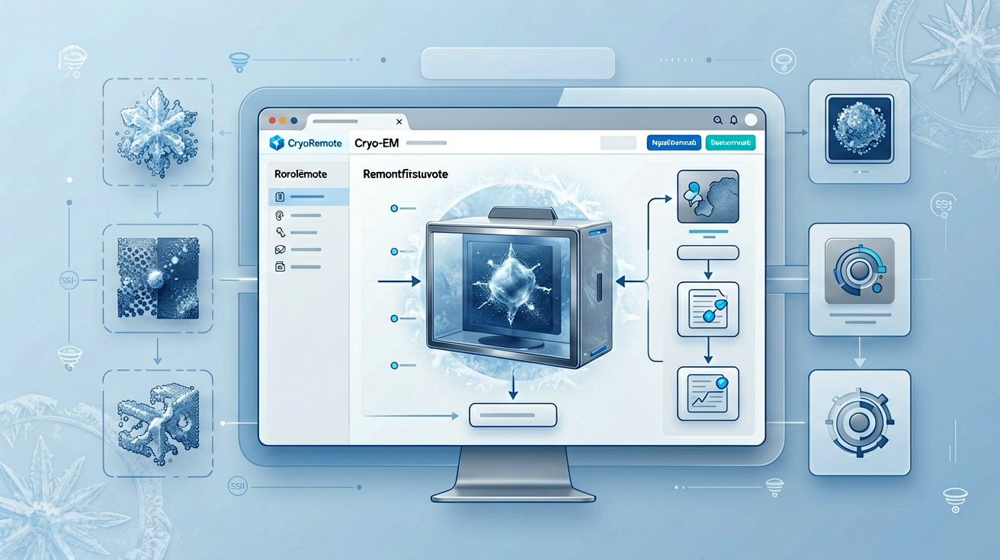
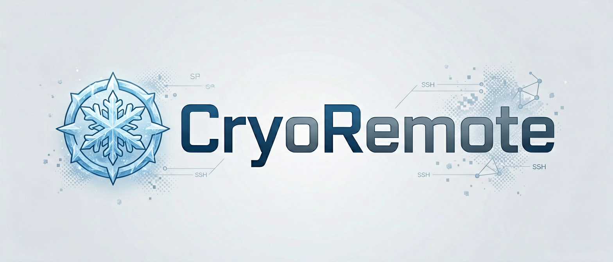

# CryoRemote



CryoRemote is a UCSF ChimeraX bundle for browsing cryo-EM projects over SSH/SFTP,
with a RELION-first project browser, remote metadata preview, cache-backed map/model opening,
and a ChimeraX command surface that can be reused later by MCP or other remote automation layers.
Editable help and image sources live in `docs/tools/` and `assets/`; package copies are generated at build time.

<p align="center">
  
</p>

## Current capabilities

- OpenSSH alias import from `~/.ssh/config`
- Paramiko-backed SFTP browsing for direct OpenSSH targets on Windows
- Session-scoped `CryoRemoteController` shared by GUI and `cryoremote ...` commands
- RELION project detection via remote `default_pipeline.star`
- Pipeline flowchart and job table views inside the ChimeraX tool
- Session-bound pipeline watcher for status refresh inside the active ChimeraX tool
- Remote preview for `.star`, `.txt`, `.log`, `.json`, `.out`, `.err`, `.cxc`, and MRC/MAP headers
- Local cache management for `.mrc`, `.map`, `.pdb`, `.cif`, and cached source copies of remote `.cxc`
- Remote `.cxc` execution by caching the command file locally, rewriting supported `open ...` file operands, and opening the rewritten local script in ChimeraX
- RELION shortcuts for:
  - `Open Latest Refine Map`
  - `Open Last Completed Job`
  - `Open Half Maps`
  - `Open PostProcess + Model`
  - `Find In Tree`

## Command surface

CryoRemote now exposes a small automation-friendly ChimeraX command namespace:

```text
cryoremote connect [alias <name>] [host <hostname>] [user <user>] [port <port>] [root <path>]
cryoremote disconnect
cryoremote status
cryoremote browse [path <path>]
cryoremote preview path <path>
cryoremote open path <path>
cryoremote refresh
cryoremote refresh pipeline
cryoremote open latest-refine
cryoremote open last-completed
cryoremote open half-maps
cryoremote open postprocess-model
cryoremote cache clear
```

Examples:

```text
cryoremote connect alias gm00 root /share/home/shark
cryoremote status
cryoremote browse path Refine3D/job001
cryoremote preview path run.out
cryoremote open path postprocess.mrc
```

- `cryoremote status`, `browse`, `preview path`, and `open path` emit stable text output intended for later automation parsing
- `cryoremote show` and `cryoremote find in-tree` remain GUI-only
- This bundle does not ship a dedicated MCP server yet; the current command layer is the intended seam for future `mcp`, `run_command`, or remote API integration

## Automation and `.cxc` boundaries

- `cryoremote connect` is non-interactive on the command path: if the host needs a password or keyboard-interactive prompt, configure SSH key/agent first or use the GUI connection flow
- Full map streaming is not implemented; maps and models are cached locally before opening
- Remote `.cxc` support rewrites only the leading file operands of `open ...`
- Nested `.cxc`, `forEachFile`, `coords`, globs, tilde-based paths, and other option-level path semantics are not rewritten
- Arbitrary remote exec is not added; remote command files still execute only through locally rewritten `.cxc` scripts

## Current limits

- Only direct aliases are supported in the current connection layer
- `ProxyJump`, `ProxyCommand`, `Include`, and `Match` are warned about but not implemented
- cryoSPARC `.cs`, Slurm integration, detached watchers, and queue/run controls are deferred

## Development and validation

Install into ChimeraX:

```powershell
chimerax-console.exe --nogui --cmd "devel install . ; exit"
```

Validation commands:

```powershell
python -m pytest
python -m compileall src tests
chimerax-console.exe --cmd "ui tool show CryoRemote ; exit"
```

Repository layout:

- `src/` - Python bundle code
- `tests/` - regression tests for caching, RELION parsing, `.cxc`, assets, and command/controller behavior
- `assets/` - brand, icon, illustration, and Agnes manifest sources
- `docs/tools/` - ChimeraX help page source

`src/assets/`, `src/docs/`, and `src/icons/` are generated package copies used for bundle builds and local `devel install`;
they are not the editable source of truth in the repository.

## Attribution

CryoRemote selectively borrows architectural ideas from:

- `uermel/chimerax-remotebrowser` (MIT)
- `hanjinliu/himena-relion`
- `RBVI/ChimeraX-Bundle-Template`

Visual PNG resources in `assets/` were generated for this bundle with Agnes AI image generation
and recorded in `assets/agnes/manifest.json`.

No source tree was forked wholesale. The current implementation is purpose-built for
ChimeraX + SSH + RELION remote visualization workflows.
